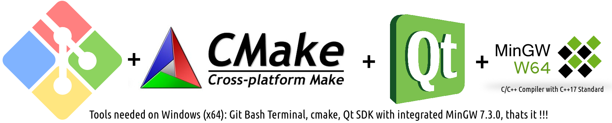

## C/C++ Toolchain 2019 for Windows and Linux 64 bit: 
A complete pure source code based C/C++ toolchain using cmake
with easy to maintain recepies, high build speed, automatic dependency graph resolution due to cmake.

The toolchain uses the QtSDK ( with the integrated MinGW 7.3.0 x64 Compiler on Windows )
I dont support VC because i hate it, ofcourse you can do with your life what you want, so do I.

# Supported Architectures
+ amd64, aka x64_86 
- Maybe support for arm64 for my Raspi and other SoC's

# Supported Operating Systems
+ Windows 64 Bit ( tested on Windows 10 + msys2 + cmake + QtSDK 5.12.3 + integrated MinGW Compiler 7.3.0 )
+ Linux 64 Bit ( tested on Xubuntu 18.04 LTS + cmake + QtSDK 5.12.3 for Linux64 )
- Maybe support for Android ( didnt ever wrote a cmake recipe for Android, so it needs time, if ever )
- Maybe support for  MacOSX 64 Bit could be supported, there is no real issue ( except lack of experience ) regarding Apple.

# Building on Linux (x64) is easy and convenient.

> sudo apt-get install cmake qtbase5-dev libxxf86vm-dev libx11-dev x11proto-xf86vidmode-dev

> cd into/benni-cmake-v6

> chmod +x ./clean.sh

> chmod +x ./build_linux.sh

> ./clean.sh

> ./build_linux.sh

# Building on Windows (x64) needs some prep and is less convenient, but works well.

- Install Git with integrated Git Bash ( A Linux Terminal Emulator much better than cmd.exe )
	
	I have no (meaningful) experience with CygWin and never needed it.
	You can also use MSYS 1.11.0 ( which i use a lot, never has issues ) or MSYS2 ( had some issues with it )
	
	
- Install cmake >= 3.10
	
- Install QtSDK 5.12.3 with integrated MinGW Compiler 7.3.0
	
- Edit *.bat Skript inside benni-cmake-v6 folder "start_LinuxTerminal_on_Windows.bat"
	The *.bat Skript adds all important Paths to the Windows environment variable %PATH%
	It adds the path to MinGW Compiler /bin directory, the path to cmake, etc.. e.g. doxygen
	The *.bat Skript then starts the MSYS2 Terminal
	! Please edit the *.bat Script to correct the paths for your machine. I installed everything somewhere else than you.
- Start *.bat Skript inside benni-cmake-v6 folder "start_LinuxTerminal_on_Windows.bat"

You are now seeing a Linux Terminal on Windows and are able to start working now...
	
## Build and Work on Windows (x64)

> cd Documents/benni-cmake-v6

> chmod +x ./clean.sh

> chmod +x ./build_linux.sh

> ./clean.sh

> ./build_win.sh